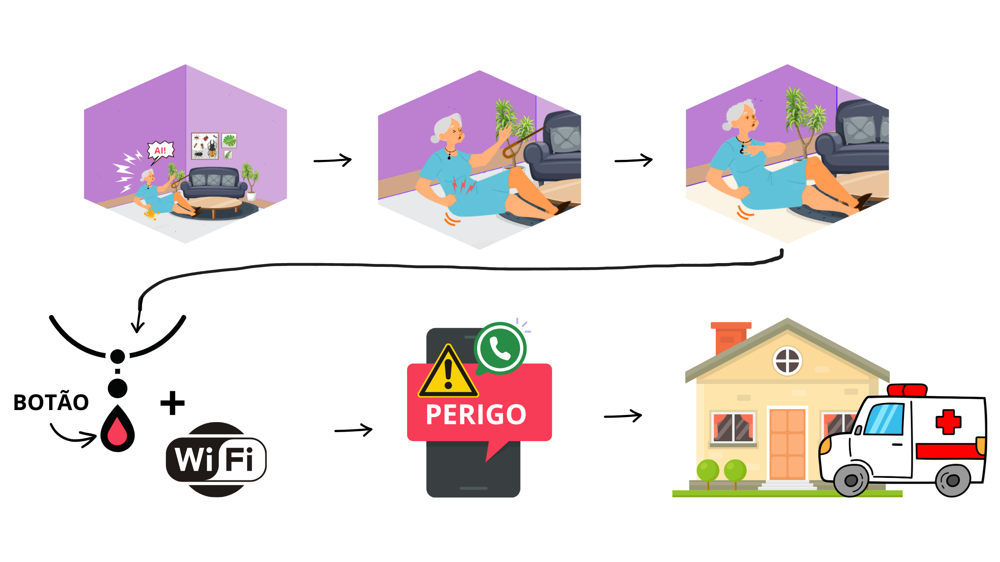
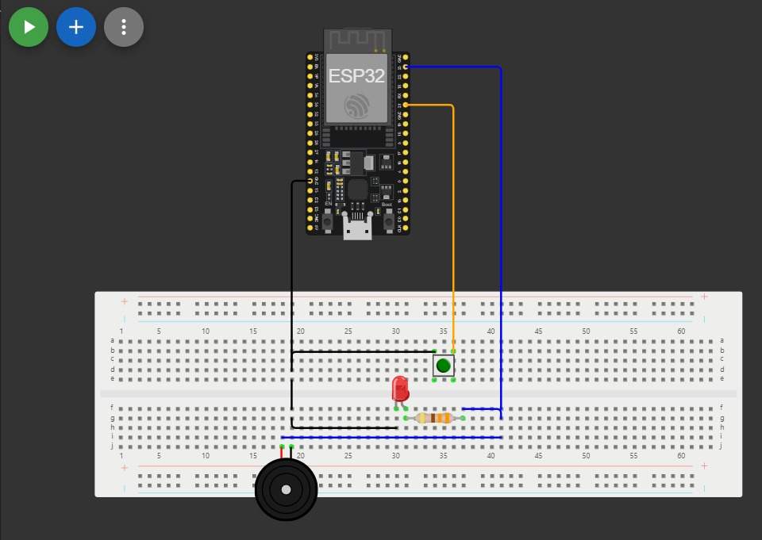
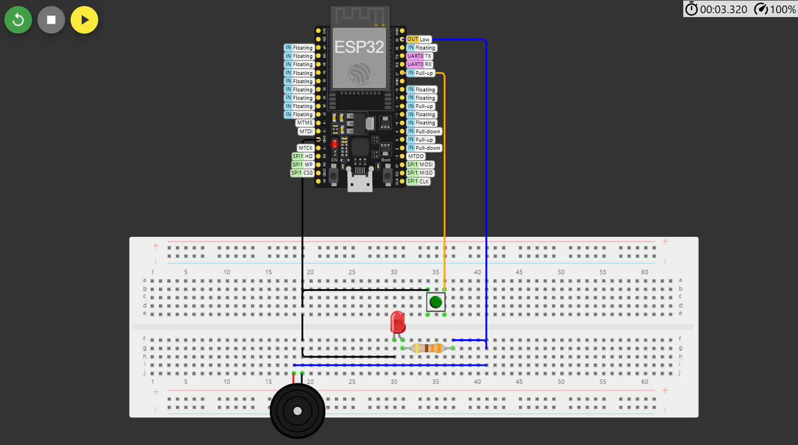

# Botão do Pânico

[Link](https://github.com/ed-henrique/maloca-das-icoisas/edit/main/botao-do-panico)

O botão do pânico é um dispositivo de segurança utilizado para alertar rapidamente autoridades ou serviços de emergência em situações de risco, como assaltos, sequestros ou agressões. Ele pode ser um botão físico ou uma função em dispositivos móveis, como aplicativos de celular, e ao ser acionado, envia um sinal discreto para a polícia, familiares ou centros de monitoramento. Casos comuns de uso incluem em situações de violência doméstica, em estabelecimentos comerciais durante um assalto, por profissionais que trabalham sozinhos em locais isolados ou por pessoas em risco iminente de perigo, como idosos ou pessoas com deficiência.

## Metas

Ao apertar o botão, devem ser realizadas essas ações:

- Envio de mensagem de socorro via Whatsapp;
- Alerta sonoro via buzzer;
- Log deve ser mostrado na tela;

## Requisitos

### Pessoal

No mínimo 1 pessoa.

### Hardware

- 1x ESP32;
- 1x LED;
- 1x Buzzer;
- 1x Botão;

### Software

- Acesso à API do Whatsapp [CallMeBot](https://www.callmebot.com/blog/free-api-whatsapp-messages/);
- Instalação da Arduino IDE, com as bibliotecas UrlEncode, HTTPClient e ESP32;

## Como Configurar Ambiente de Desenvolvimento

1. Monte o circuito conforme o especificado na [Simulaçao](#simulacao);
2. Instalar as dependências;
3. Utilizar o [código-fonte](./main.ino), modificando as variáveis e constantes destacadas como `IMPORTANTE` com os seus dados;
4. Compilar o código e enviá-lo ao ESP32;
5. Executar;

## Etapas

### Situação Hipotética

1. Paciente se acidenta;
2. Paciente necessita de socoroo;
3. Paciente aciona botão do pânico;
4. O pedido de socorro é enviado via wifi;
5. O cuidador recebe o pedido de socorro via Whatsapp;
6. O cuidador vai prestar socorro ao paciente;

## Simulação

[Link](https://wokwi.com/projects/416021965167276033)

- O pino 21 se conecta ao resistor de 330 ohms e ao polo positivo do buzzer;
- O pino 23 se conecta ao botão;
- O GND se conecta ao botão, ao polo negativo do LED e ao polo negativo do buzzer;
- O resistor se conecta ao polo positivo do LED;

## *Proof of Concept (PoC)*

https://github.com/user-attachments/assets/694ea2ef-6716-475d-92dc-67022a44746a
