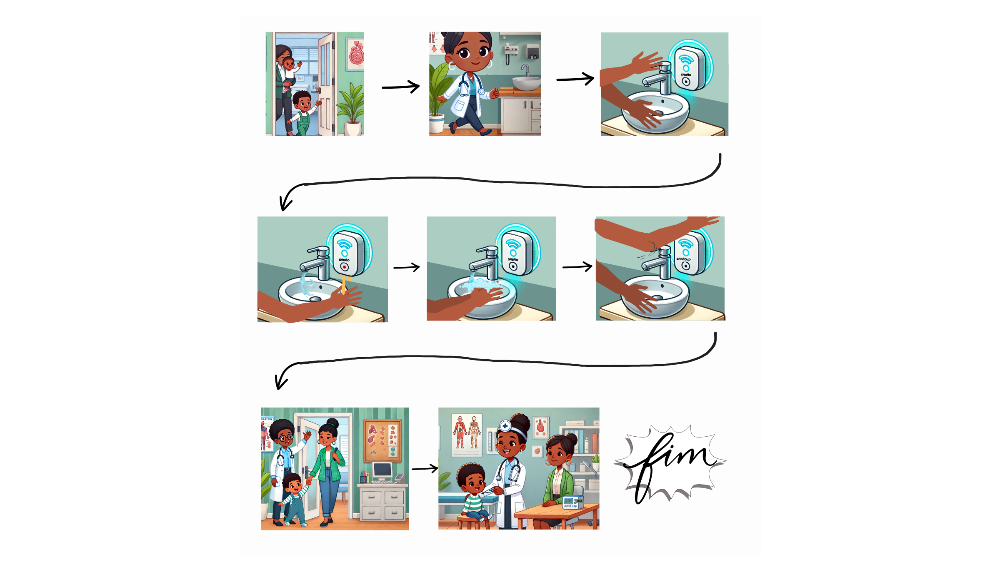
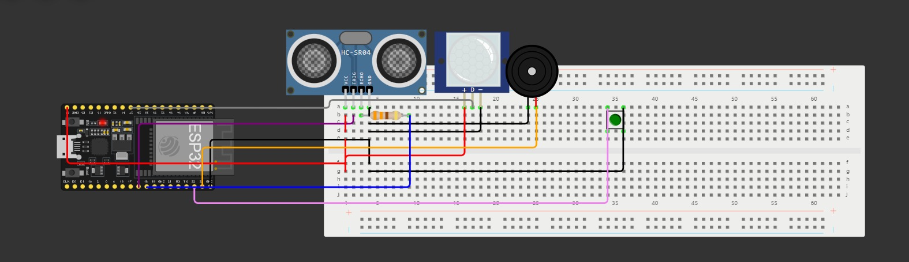
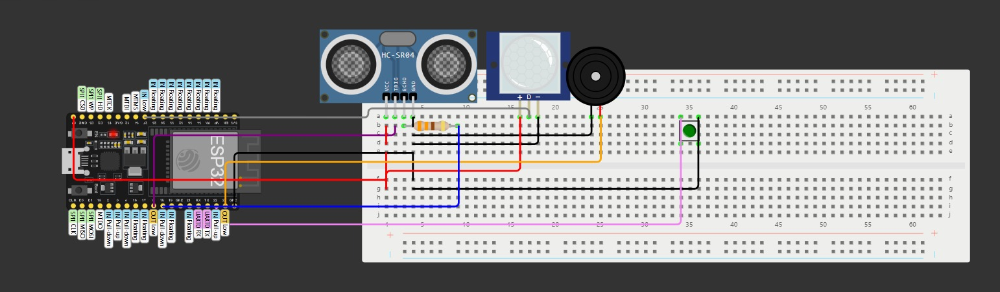

# Dispenser de Sabão

[Link](https://github.com/ed-henrique/maloca-das-icoisas/edit/main/dispenser-de-sabao)

O projeto de IoT propõe um sistema automatizado para dispenser de sabão, integrando sensores de presença ultrassônicos e PIR (infravermelho passivo) com um botão físico. Os sensores de presença detectam a aproximação das mãos do usuário, ativando o dispenser de sabão de forma automática. Caso o usuário esteja em uma distância adequada, o botão permite uma ativação manual caso necessário. O sistema pode ser monitorado remotamente, enviando dados sobre o uso, como frequência e duração das ativações, promovendo maior controle e eficiência no consumo de sabão, além de garantir higiene sem necessidade de contato direto.

## Metas

Ao ser detectado movimento e presença numa distância de 30 centímetros, uma mensagem deve ser enviada indicando que alguém estava presente. Além disso, se o botão for apertado enquanto foi detectada a presença, o dispenser de sabão deve liberar sabão, o que é indicado via uma mensagem e o barulho do buzzer.

## Requisitos

### Pessoal

No mínimo 1 pessoa.

### Hardware

- 1x ESP32;
- 1x Botão;
- 1x Buzzer;
- 1x Sensor PIR;
- 1x Resistor 330 Ohms;
- 1x Sensor Ultrassônico;

### Software

- Instalação da Arduino IDE com a biblioteca ESP32;

## Como Configurar Ambiente de Desenvolvimento

1. Monte o circuito conforme o especificado na [simulação](#simulacao);
2. Instalar as dependências;
3. Utilizar o [código-fonte](./main.ino);
4. Compilar o código e enviá-lo ao ESP32;
5. Executar;

## Etapas

### Situação Hipotética

1. Médico Finaliza atendimento de paciente e se encaminha para a pia, se aproximando do dispenser antes de atender um paciente;
2. O sensor detecta a presença e libera sabão automaticamente ou mediante o acionamento do botão;
3. Médico higieniza as mãos, mantendo cuidado com as mãos que foram higienizadas.
4. Médico recebe um novo paciente. 
5. Após o atendimento, o médico utiliza novamente o dispenser para higienizar as mãos;
6. Dados sobre a frequência e duração de uso são enviados para um sistema remoto, permitindo monitoramento e controle de suprimentos.
7. 
## Simulação

[Link](https://wokwi.com/projects/416623482930152449)

## *Proof of Concept (PoC)*

https://github.com/user-attachments/assets/2d111d01-7381-4c85-a25d-63237c8b1836
